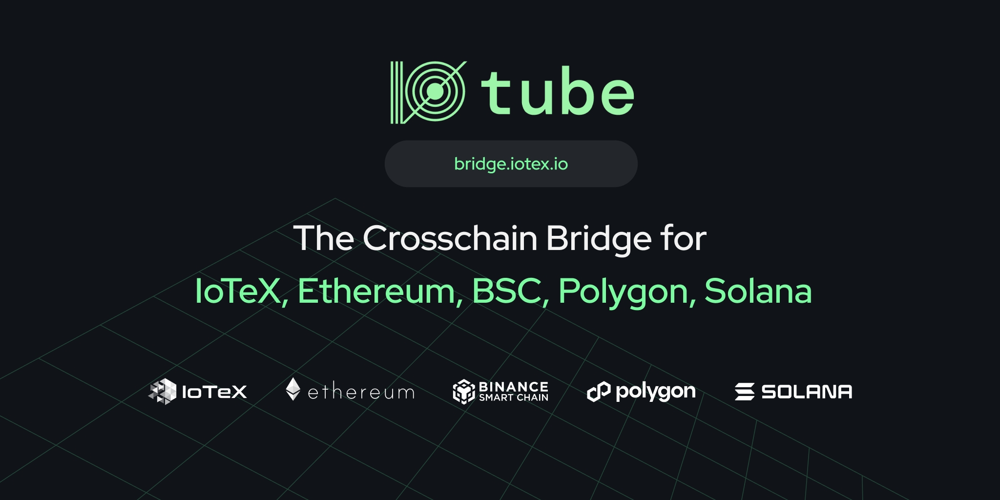

# Welcome to ioTube

**Introducing ioTube**

[ioTube](https://iotube.org) is a cross-chain bridge designed to be decentralized, multi-chain, and multi-asset.

[ioTube ](https://iotube.org/)enables bi-directional exchange of tokens between IoTeX, Ethereum, Binance Smart Chain, Polygon, and Solana.

<figure><figcaption></figcaption></figure>

### **Ready to get started?**&#x20;

Check out our step-by-step tutorials on how to convert tokens between [Polygon-IoTeX](https://community.iotex.io/t/iotube-tutorial-cross-transfer-tokens-between-polygon-and-iotex/2735), [Ethereum-IoTeX](https://community.iotex.io/t/iotube-tutorial-moving-tokens-between-ethereum-and-iotex/1452), and [BSC-IoTeX](https://community.iotex.io/t/iotube-tutorial-moving-tokens-between-binance-smart-chain-and-iotex/2218).&#x20;

### Learn more

For any questions, please reach out to an Admin on [Discord](https://iotex.io/devdiscord) or [Telegram](https://t.me/IoTeXGroup).

⭐ Hosting at: [https://bridge.iotex.io/](https://bridge.iotex.io/)
