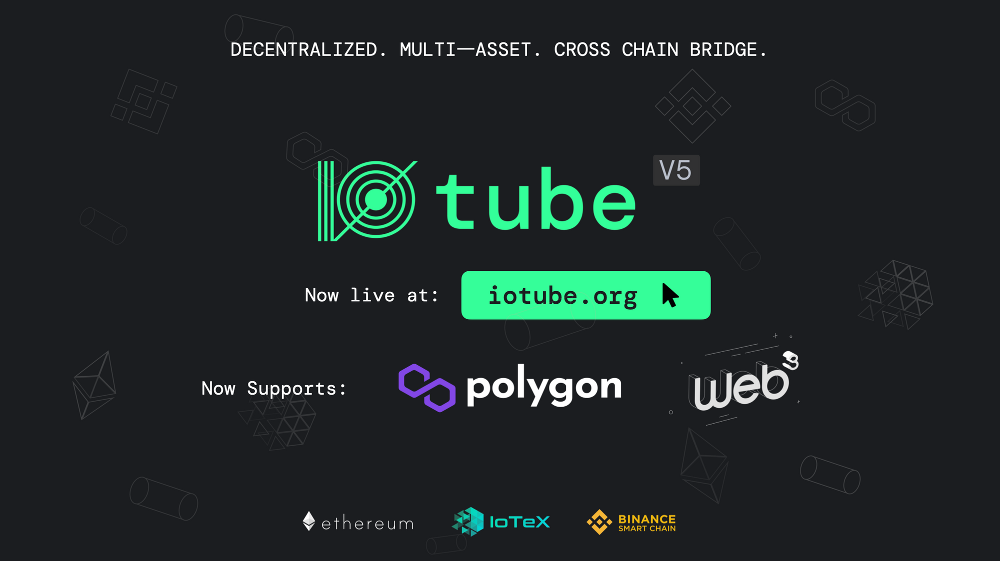

# Welcome to ioTube

### **Introducing ioTube**

[ioTube](https://iotube.org) is the decentralized bridge for connecting Ethereum, Binance Smart Chain, Polygon (Matic), and IoTeX. [ioTube ](https://iotube.org)enables bi-directional exchange of tokens between [IoTeX](https://iotex), [Ethereum](https://ethereum.org), [Binance Smart Chain](https://www.binance.org/en/smartChain), and now [Polygon](https://polygon.technology)!&#x20;

### ioTube v5

ioTube v5 is a major upgrade to our already sophisticated cross-chain bridge. With support for [20+ assets](https://tube.iotex.io/assets) from Polygon, Ethereum, and BSC, IoTeX is now one of the most connected blockchains in the industry!&#x20;

We are excited to take this major leap in expanding the footprint of IoTeX to three of the largest blockchains in the world and broadening the utility of `IOTX` and `XRC20` tokens.

Even better, we have fully open-sourced ioTube v5 on [GitHub](https://github.com/iotexproject/ioTube) and made it compatible with Web3 wallets (e.g., MetaMask, ioPay Mobile) for an incredible user experience. This major cross-chain bridge update includes the following features:

* **Polygon Support:** transfer tokens with ultra-low fees between IoTeX and Polygon. ioTube v5 supports a variety of Polygon assets, including `MATIC`, `WETH`, `WBTC`, `DAI`, `USDT`, `USDC`, `SUSHI`, `QUICK`, `CYC`
* **Web3-compatibility:** use your favorite Web3 wallet (e.g., MetaMask, ioPay Mobile) to access ioTube v5 anytime, anywhere
* **Enhanced Performance:** ioTube v5 is faster than ever with ultra-low fees enabling users to bridge assets cross-chain with confidence
* [**Cross-chain Explorer**](https://tube.iotex.io/explorer#iotex)**:** see real-time analytics of all cross-chain transactions in addition to other analytics such as total TVL, chains, and assets

### **Ready to get started?**&#x20;

Check out our step-by-step tutorials on how to convert tokens between [Polygon-IoTeX](https://community.iotex.io/t/iotube-tutorial-cross-transfer-tokens-between-polygon-and-iotex/2735), [Ethereum-IoTeX](https://community.iotex.io/t/iotube-tutorial-moving-tokens-between-ethereum-and-iotex/1452), and [BSC-IoTeX](https://community.iotex.io/t/iotube-tutorial-moving-tokens-between-binance-smart-chain-and-iotex/2218).&#x20;

### Learn more

For any questions, please reach out to an Admin on [Discord](https://iotex.io/devdiscord) or [Telegram](https://t.me/IoTeXGroup).

⭐️ **IoTeX & Polygon:** _learn more about our_ [_partnership_](https://iotex.medium.com/iotex-polygon-matic-partner-for-real-world-nfts-on-opensea-cross-chain-bridge-8506e5e23773) _with Polygon._

⭐ **New ioTube URL:** _access ioTube at our new URL_ [_iotube.org_](https://iotube.org)
