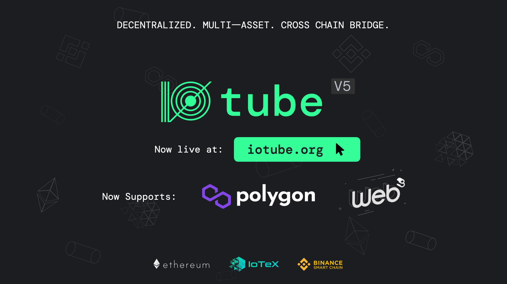

# USDC on IoTeX Tutorial

## Introduction to USDC Bridging on IoTeX

With ioTube v7, bridging `USDC` from Ethereum to IoTeX has become simpler and more efficient. The new update introduces `USDC.e`, replacing `ioUSDC` as the bridged token for `USDC` on IoTeX, aligning with [Circle’s Bridged USDC Standard](https://www.circle.com/bridged-usdc). This upgrade provides seamless compatibility and prepares IoTeX for future integrations with Circle’s native USDC issuance, enhancing security and user experience.


`USDC.e` on IoTeX is currently exclusive to the Ethereum chain, serving as the Ethereum-based bridged version of `USDC`. It can only be bridged between IoTeX and Ethereum. For other supported networks, please use the respective network-specific `USDC` tokens (`USDC_m` for Polygon and `USDC_b` for BNB Smart Chain) to ensure compatibility.


## **Bridging `USDC` from Ethereum to IoTeX**

### 1. Connect your Wallet

Open [iotube.org](https://iotube.org) and connect your wallet. Select the "**Deposit to IoTeX"** tab, and "Ethereum" as the source network:

<figure><figcaption></figcaption></figure>

### 2. Select and Bridge USDC

Locate `USDC` in the tokens list:

<figure><figcaption></figcaption></figure>

enter the **amount** to bridge, and click the **Transfer** button.&#x20;


You might be asked to approve **two** transactions in your wallet: one to approve the `USDC` token transfer, the second to perform the actual transfer.


<figure><figcaption></figcaption></figure>

### 3. Receive `USDC.e` Directly on IoTeX

After the transactions are confirmed, your bridged `USDC` will be available after a few minutes as `USDC.e` directly on the IoTeX network. No additional conversion steps are required, thanks to ioTube v7’s auto-conversion.&#x20;

The bridging process can be monitored on the [iotube explorer](https://bridge.iotex.io/transactions#iotex).

## Bridging `USDC.e` from IoTeX to Ethereum

### 1. Connect your Wallet

Open [iotube.org](https://iotube.org) and connect your wallet. Select the **Withdraw from IoTeX** tab, and Ethereum as the destination network:

### 2. Select `USDC.e` and the amount to bridge

Select `USDC.e` from the tokens list, enter the amount of `USDC.e` you wish to bridge back to Ethereum:

<figure><figcaption></figcaption></figure>

### 3. Initiate the Withdrawal

You will need to have enough `IOTX` in your wallet to cover the Ethereum network fee (as indicated in the ioTube app), plus approximately `0.5 IOTX` for the IoTeX network fee. Click the **Withdraw** button and approve the two required transactions in Metamask.\

### 4. Receive USDC on the Ethereum Network

On completion, you will receive `USDC` directly on the Ethereum network, without any further swaps required.

The bridging process can be monitored on the [iotube explorer](https://bridge.iotex.io/transactions#eth).
